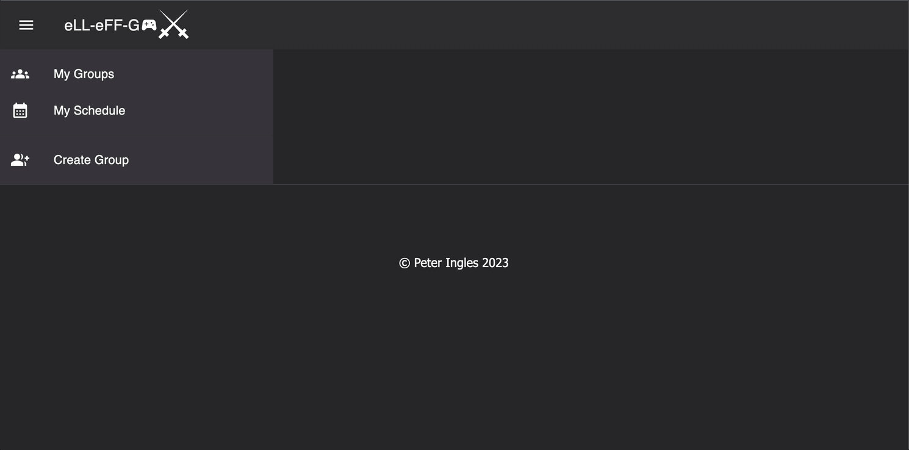

# eLL-eLL-G

## Introduction
This was a two week sprint solo project that was built from conceptualization, design and production entirely by myself, Peter Ingles. It represents a culmination of technologies and practices that I developed as a student at Prime Digital Academy.

The project titled eLL-eFF-G (like LFG meaning "Looking for Group ''), is a scheduling application for busy adults to notify friends of the times they are available to participate in group gaming/tabletop.
## Contents

Functionality of this project include:

Functions of the app include:
Joining groups,
Signing up for activities by day of the week and time,
Visual display for groups having enough participants,
A user schedule which shows all activities for the user regardless of Group or game,
and create a group page to start new groups based around different games and/or people.

To get started:
Open terminal and run 'npm run server'
Open a second terminal and 'npm run client'

This will navigate you to the landing page (if you're not redirected open http://localhost:3000/ on your web application) where you can then register to be a user and engage with the application.

## Tech Stack

**Client:** React, Redux, MaterialUI

**Server:** Node, Express, Redux-Saga

**Databade:** PostgreSQL

**Additional:** Figma, Postman, VSCode, Render and Heroku for deployment

## Summary

The experience of building an app from the ground up was invaluable, and a huge learning experience on the life cycle of software development. With the insights I've gained I'm excited at building more apps in the future more efficiently and with an even greater scope.

Furthermore this was the most complete practice with React, Node, Express, Redux, Redux-Saga and PostgreSQL I've had yet and feel that my skills with these technologies are at the sharpest they've ever been because of it.

## Authors

This project was made entirely by myself, with the incredible support of the staff at Prime Digital Academy, my wonderful peers in the Iolite cohort and a special thanks to my teacher Key!

My github and Linkedin are listed below, I would love to collaborate and work to add features to this app, so please reach out if you'd like to assist!

Thanks again for checking out our project and GAME ON!

- Peter Ingles https://github.com/PeterIngles https://www.linkedin.com/in/peter-ingles/

